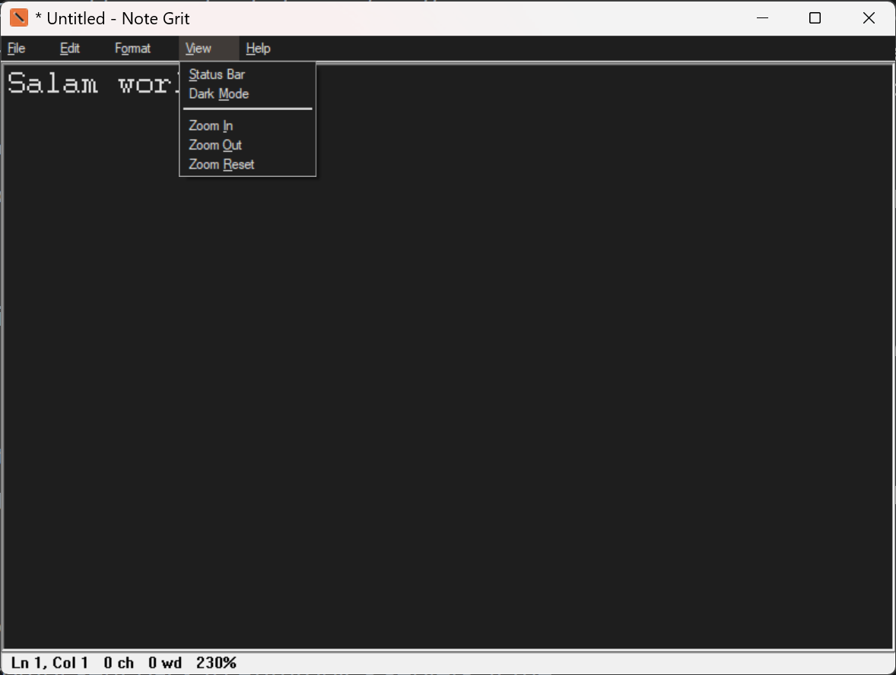
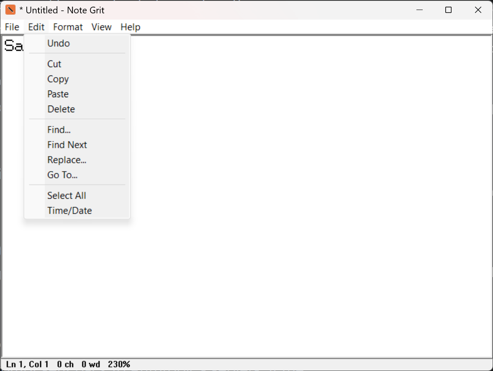
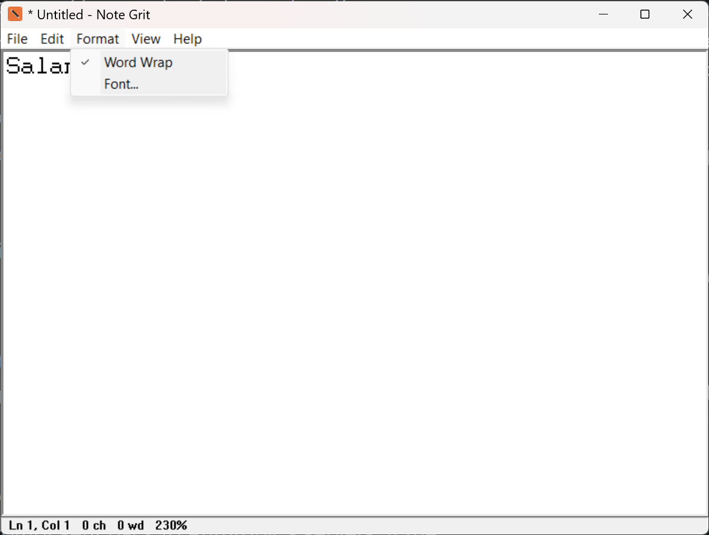
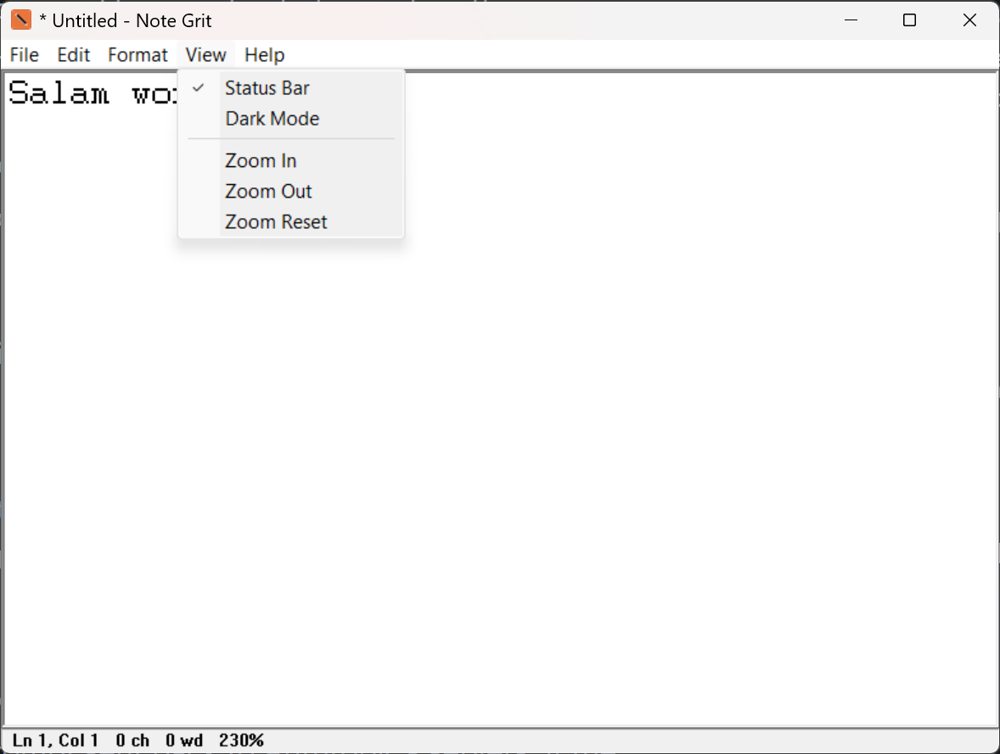
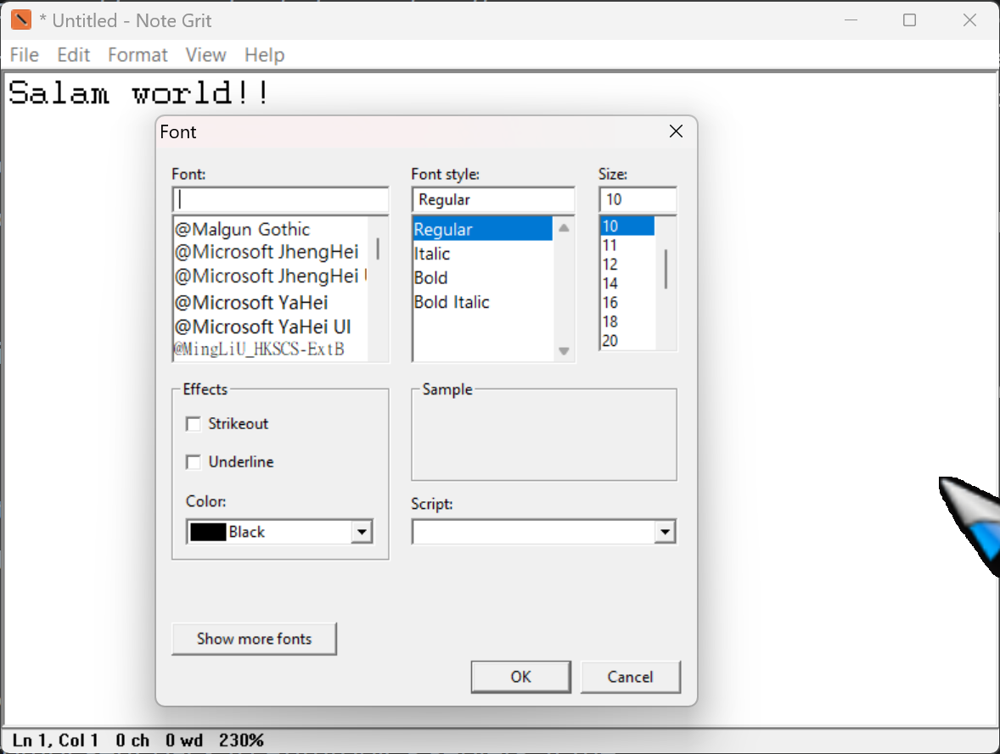
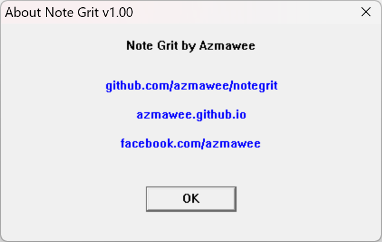

# NoteGrit

**A tiny, blazing-fast text editor for Windows, in a single 16 KB executable.**


NoteGrit is a featherweight plain-text editor for **Windows 10 and 11**. It ships as
one **16 KB** `.exe` with **no runtime, no dependencies, no .NET, no Electron**, just pure
x86 assembly. It opens instantly, remembers your theme and zoom, edits huge files without
breaking a sweat, and even comes with its own tiny Windows installer.

If you've ever wanted **the Notepad you already know, but smaller, darker, and smarter**,
this is it.

---

## ✨ Why NoteGrit?

- **16 KB, total.** The whole editor, icons and all, is smaller than a single photo.
  Roughly **1/250th the size of Notepad++** and **1/6000th of VS Code** (see
  [How small is 16 KB?](#how-small-is-16-kb)).
- **Instant startup.** No frameworks to load, no JIT, double-click and you're typing.
- **Familiar.** Classic Notepad layout, menus, and shortcuts. Nothing to relearn.
- **Dark Mode.** Editor, menu bar **and** status bar theme together, and it **stays dark**
  after you close and reopen.
- **Smooth zoom.** `Ctrl` + `mouse wheel` (browser-style), `Ctrl`+`+` / `Ctrl`+`-` /
  `Ctrl`+`0`, with the live zoom % in the status bar. Your zoom level is remembered.
- **Live counts.** Words, characters, line and column, updated as you type.
- **Big files.** Large files are streamed into the editor via chunked `ReadFile`, so peak
  memory stays low.
- **Truly portable.** Copy one `.exe` to a USB stick and run it anywhere: no install, no
  registry, no admin rights.
- **Real installer, also in assembly.** A second ~16 KB `Win_x86_64_Installer.exe`
  (built from the same FASM source) wires up `Win+R → notegrit`, **Open With**,
  **Apps & Features**, an uninstaller, and an optional **"Edit with NoteGrit"** right-click
  menu. Ships in a tiny ZIP next to `notegrit.exe` (no embedded payload, AV-friendly).
- **Open source.** BSD-2-Clause. Builds with **FASM only**: no SDK, no linker, no
  third-party tooling.

---

## 📦 Features

| Menu | What you get |
|------|--------------|
| **File** | New, Open, Save, Save As, Page Setup, Print, Exit |
| **Edit** | Undo, Cut, Copy, Paste, Delete, Find, Find Next, Replace, Go To, Select All, Time/Date |
| **Format** | Word Wrap, Font |
| **View** | Status Bar, **Dark Mode**, Zoom In / Out / Reset |
| **Help** | About (with project links) |

**Extras:** drag-and-drop open, command-line file open, right-click context menu,
word/char/line/col status bar, persistent Dark Mode + Zoom.

**Keyboard shortcuts:** `Ctrl+N/O/S` (Save As = `Ctrl+Shift+S`), `Ctrl+P` (Print),
`Ctrl+F/H/G` (Find/Replace/Go To), `F3` (Find Next), `F5` (Time/Date),
`Ctrl`+`+`/`-`/`0` and `Ctrl`+`wheel` (Zoom).

---

## 📸 Screenshots

**Dark mode** with the live status bar (line/col, char/word count, zoom %):



**Menus:**

| Edit | View | Format |
|:---:|:---:|:---:|
|  |  |  |

**Font picker and About dialog:**

| Font dialog | About |
|:---:|:---:|
|  |  |

---

## ⬇️ Download

The [**Releases** page](../../releases) has **two downloads**, pick what suits you:

| Download | Use it if... |
|----------|--------------|
| **`Win_x86_64_Installer.zip`** (~11 KB) | You want a **proper Windows install**. Contains `Win_x86_64_Installer.exe` + `notegrit.exe`. Extract to get a `NoteGrit_Installer\` folder, run the installer inside. |
| **`notegrit.exe`** (~16 KB) | You want the **portable** editor. It's the whole app, no install, no admin, just run it (or drop it on a USB stick). |

Current release is **v1.00**. See [Checksums](#-checksums) below to verify your download,
or [Build](#-build) from source in seconds.

---

## 🔐 Checksums

Verify your downloads against these SHA256 hashes (v1.00):

```
5d352e14917875e54c1ff1eb8e0d864e76963a16d579893e03096ba893cfb6ea  notegrit.exe
9a05747d0777b6a8ae3b27fb3b79fcb59f0cf29ccf7efe2ea0f7edbc0418724a  Win_x86_64_Installer.zip
```

PowerShell:

```powershell
Get-FileHash -Algorithm SHA256 notegrit.exe
Get-FileHash -Algorithm SHA256 Win_x86_64_Installer.zip
```

Or, GNU-style on any shell with `sha256sum`:

```
sha256sum -c <<EOF
5d352e14917875e54c1ff1eb8e0d864e76963a16d579893e03096ba893cfb6ea  notegrit.exe
9a05747d0777b6a8ae3b27fb3b79fcb59f0cf29ccf7efe2ea0f7edbc0418724a  Win_x86_64_Installer.zip
EOF
```

---

## 🖥️ Install (proper Windows install)

Download **`Win_x86_64_Installer.zip`**, extract it to get a **`NoteGrit_Installer\`** folder
(both files inside), then run **`Win_x86_64_Installer.exe`** (it asks for admin via UAC).
The installer copies `notegrit.exe` (which must sit beside it) into the install folder. A
small setup dialog appears showing the install folder and exactly what it will do, with
three options:

- **[✓] Add "Edit with NoteGrit" to the right-click menu** *(on by default)*, right-click
  *any* file to open it in NoteGrit.
- **[ ] Set as the recommended .txt editor** *(off by default)*, appears in Open With /
  Default Apps.
- **[ ] Portable (extract only, no registry entries)** *(off by default)*, just extracts
  `notegrit.exe` into the folder shown, no `Win+R`, no Open With, no uninstaller. Same as a
  portable download but from inside the installer.

Click **Install** and the installer copies `notegrit.exe` to
`C:\Program Files (x86)\NoteGrit\`, registers it for **Win+R → `notegrit`**, adds it to
**Open With** and **Apps & Features** (so you can uninstall it from Settings), and applies
the chosen options. Tick **Portable** instead and it only copies the `.exe`, nothing else.

---

## 🚀 Portable (no install)

Want it portable? Just download **`notegrit.exe`** from the Releases page. It runs
standalone with **no install and no registry entries**. Copy it to any folder or USB drive
and you're done, no installer needed.

The installer can also copy `notegrit.exe` (must sit beside it) for you on the command line:

```
Win_x86_64_Installer.exe /portable                       # copies beside the installer
Win_x86_64_Installer.exe /portable "D:\Tools\NoteGrit"   # copies a copy there
```

---

## 🔨 Build

You need [FASM](https://flatassembler.net) (portable, ~2 MB, e.g. `fasmw17332.zip`)
extracted to `tools\fasm\`. Then:

```
avengers_assemble.bat
```

This assembles both binaries from source and packages them into a release ZIP:

- `src\notegrit.asm` → `notegrit.exe` (the editor, ~16 KB)
- `src\installer.asm` → `Win_x86_64_Installer.exe` (the setup; copies `notegrit.exe`
  from beside it at install time, no embedded payload, ~17 KB)
- both → `Win_x86_64_Installer.zip` (a `NoteGrit_Installer\` folder containing the two
  binaries, ~11 KB)

Rebuild from a clean checkout anytime:

```
git clone https://github.com/azmawee/notegrit.git
cd notegrit
:: place FASM at tools\fasm\ , then:
avengers_assemble.bat
```

Both binaries are **uncompressed** FASM PEs: no SDK, no Crinkler, no UPX, no packing.

---

## 🤏 How small is 16 KB?

| Editor | Approx. size | vs NoteGrit |
|--------|-------------|-------------|
| **NoteGrit** | **0.016 MB** | - |
| Windows Notepad (classic) | ~0.18 MB | ~12× |
| Notepad++ | ~4 MB | ~270× |
| Sublime Text | ~10 MB | ~670× |
| VS Code | ~95 MB | ~6300× |

*Sizes are approximate, for perspective only.* NoteGrit fits its entire feature set (dark
mode, zoom, word count, streamed file loading, and an installer) into 16 KB.

---

## 🛡️ About antivirus

NoteGrit ships **uncompressed** (a plain FASM PE) with a deliberately small import table
(no `CreateFileMapping`, no `ShellExecute`, no `LoadLibrary` for known Windows DLLs), so it
is almost never flagged, unlike tiny *packed* executables.

**Known false positive.** Some vendors (notably F-Secure, Avira, and a few others using
the Bitdefender engine) still flag `notegrit.exe` as `TR/Crypt.XPACK.Gen` or a similar
generic packer/trojan detection. This is a **false positive** caused by the tiny size
(~15.5 KB) combined with a minimal import table, which looks similar to real packers to
their heuristics. There is **no packing, no encryption, no obfuscation**, and the full
source is in `src/` for anyone to audit.

**What to do if it is flagged:**

- Submit `notegrit.exe` to the vendor as a false positive sample:
  - F-Secure: https://www.f-secure.com/en/home/support/samples
  - Microsoft: https://www.microsoft.com/en-us/wdsi/filesubmission
  - Your AV vendor's sample submission page
- Add the install folder (or the portable `.exe` location) to your AV exclusions while the
  signature update propagates, usually 1 to 2 weeks after submission.
- An AV that quarantines *and locks* the exe will also block rebuilds with a
  `write failed` error until the quarantine entry is cleared.

**Signing is coming.** v1.00 is currently **unsigned**. An application to
[SignPath Foundation](https://signpath.org) (free Authenticode signing for open-source
projects) is **pending approval**. Once approved, release builds will be signed via CI on
GitHub, and signed binaries will ship from the next release onward. Local builds from
source remain unsigned by default.

---

## 🔒 Safety & honesty

- The editor needs **no admin rights** and only ever touches the file you open.
- Only `Win_x86_64_Installer.exe` writes to `HKLM` / `Program Files`, and only standard, documented
  keys (App Paths, Open With, Apps & Features, an optional `.txt` ProgID and right-click
  verb), all fully reversible via uninstall.
- Per-user settings (Dark Mode, Zoom) live in `HKCU\Software\NoteGrit`, never in
  `Program Files`. The font resets each launch.

---

## 📝 Make it the default `.txt` editor

Windows 10/11 **blocks silent default-app changes** (UserChoice hash protection), so the
installer registers NoteGrit to *appear* in Open With / Default Apps rather than forcing the
default. On Windows 11, open `ms-settings:defaultapps` and pick NoteGrit for `.txt`.

---

## 🆕 Release v1.00

First public release. Ships two files:

- **`notegrit.exe`** (15872 bytes / ~15.5 KB) - the portable editor.
- **`Win_x86_64_Installer.zip`** (11403 bytes / ~11 KB) - a `NoteGrit_Installer\` folder
  containing `Win_x86_64_Installer.exe` and `notegrit.exe` side by side.

Both are 32-bit Windows PE files (run on x86 and x64 Windows 10/11), built directly from
the FASM source in `src\`. See [Checksums](#-checksums) to verify your download.

---

## 🙏 Credits

NoteGrit is written and maintained by **[azmawee](https://github.com/azmawee)**.

---

## 📄 License

BSD 2-Clause License, see [LICENSE](LICENSE). Free for any use, commercial included.
